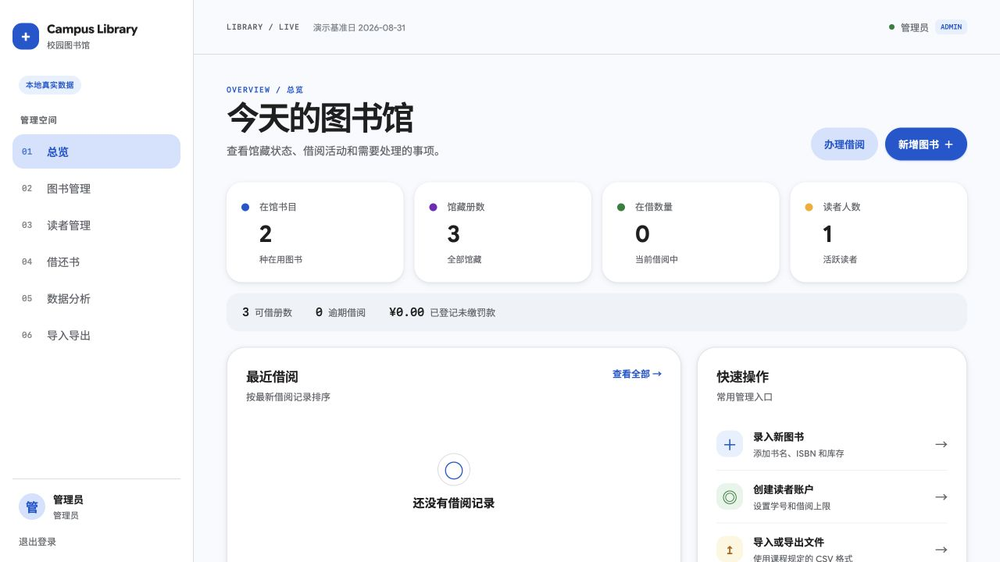
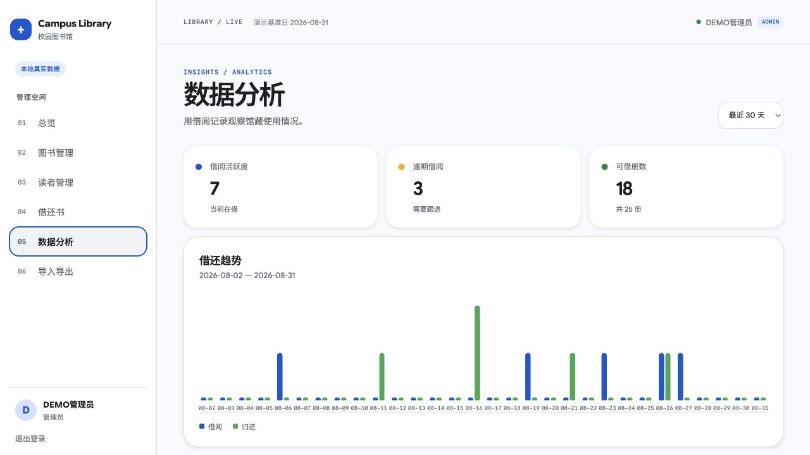
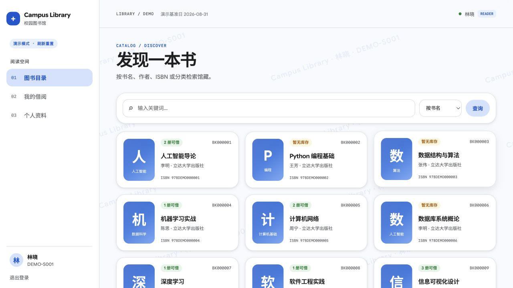

# Campus Library Management System / 校园图书管理系统

A course-oriented full-stack library management system for books, readers, borrowing, returns, fines, CSV import/export, and administration. The backend is a FastAPI + SQLAlchemy + SQLite service. The frontend is a React + TypeScript + Vite application with a Google Material 3 inspired visual language and a demo mode for static hosting.

这是一个面向课程考核的前后端一体化图书管理系统，覆盖图书、读者、借阅、归还、罚款、CSV 文件读写、统计分析和管理员操作。后端使用 FastAPI、SQLAlchemy 和 SQLite；前端使用 React、TypeScript 和 Vite，采用 Google Material 3 风格，并提供适合静态部署的演示模式。

**Repository / 仓库:** [github.com/kanfanle233/campus-library-management-system](https://github.com/kanfanle233/campus-library-management-system)

[English](#english) · [中文](#中文)

---

## English

### Contents

- [Overview](#overview)
- [Features](#features)
- [Screenshots](#screenshots)
- [Architecture and workflow](#architecture-and-workflow)
- [Technology stack](#technology-stack)
- [Project structure](#project-structure)
- [Backend API](#backend-api)
- [Domain rules and algorithms](#domain-rules-and-algorithms)
- [Getting started](#getting-started)
- [Frontend modes](#frontend-modes)
- [Quality checks](#quality-checks)
- [Course assessment evidence](#course-assessment-evidence)
- [Security notes](#security-notes)
- [References and citation recommendations](#references-and-citation-recommendations)
- [License](#license)

### Overview

The application has two coordinated runtime modes:

1. **Demo mode:** the frontend creates deterministic in-browser data. It requires no backend and is suitable for GitHub Pages, screen recording, and report screenshots.
2. **Live mode:** the frontend calls the local FastAPI API. SQLite remains the source of truth for real CRUD, circulation, file, and analytics operations.

The demo reference date is <code>2026-08-31</code>, so screenshots and test data can be reproduced. Authenticated pages include a low-opacity diagonal watermark containing the signed-in user identity. The login page includes the course production watermark <code>202314109方昕哲制作 · 20260831</code>.

### Features

| Area | Implemented behavior |
| --- | --- |
| Authentication | JWT bearer login, current-user lookup, active-account checks, administrator and reader roles |
| Book management | Create, edit, search by title/author/ISBN/category/book code, deactivate, inventory display |
| Reader management | Create, edit, deactivate, borrow-limit management, duplicate student-ID validation |
| Circulation | Borrow, return preview, return, receipt data, fine payment, inventory restoration |
| Analytics | Dashboard totals, 7/30/90-day borrow/return trends, category inventory, popular books, overdue buckets |
| File operations | UTF-8/UTF-8-BOM book CSV import, all-or-nothing validation, book/reader/loan CSV export |
| Frontend roles | Administrator workspace and reader workspace with guarded navigation |
| UX | Responsive sidebar, Google Sans Flex/Noto Sans SC typography, status pills, loading states, error messages, print-friendly receipt |

### Screenshots

The following screenshots are versioned under <code>frontend/screenshots/</code> and can be rendered directly by GitHub.

| Login and watermark | Administrator overview |
| --- | --- |
|  |  |

| Analytics | Reader workspace watermark |
| --- | --- |
|  |  |

Additional evidence images include [book and reader management](frontend/screenshots/admin-overview.png), [login](frontend/screenshots/login.png), [real-data admin view](frontend/screenshots/watermark-live-admin.png), and [analytics viewport](frontend/screenshots/analytics-viewport.png).

### Architecture and workflow

#### Runtime architecture

~~~mermaid
flowchart LR
    Browser["Browser / 浏览器 React + TypeScript + Vite"] --> Gateway{"Data Gateway 数据网关"}
    Gateway --> Demo["Demo mode 内存演示数据"]
    Gateway --> API["Live mode FastAPI REST /api/v1"]
    API --> Auth["JWT + role checks 认证与权限"]
    API --> Service["Domain services 业务服务"]
    Service --> Repo["Repositories 数据访问层"]
    Repo --> DB[("SQLite library.db")]
    API --> Docs["OpenAPI /docs 接口文档"]
    Browser --> Pages["HashRouter pages 静态页面路由"]
~~~

#### Borrow and return workflow

~~~mermaid
sequenceDiagram
    participant U as User / 用户
    participant F as React frontend / 前端
    participant A as FastAPI API
    participant S as Loan service / 借阅服务
    participant D as SQLite

    U->>F: Submit borrow request / 提交借阅
    F->>A: POST /api/v1/loans/borrow
    A->>S: Validate actor, reader, book / 校验身份、读者和图书
    S->>D: BEGIN IMMEDIATE
    S->>D: Check stock, limit, overdue loans
    S->>D: Decrement inventory and insert loan
    D-->>S: Commit one transaction / 一次提交
    S-->>A: Loan receipt data / 借阅凭单数据
    A-->>F: JSON response
    F-->>U: Refresh inventory and dashboard / 更新库存与统计

    U->>F: Open return preview / 查看归还预览
    F->>A: GET /loans/{id}/return-preview
    A->>S: Calculate overdue days and fine
    S-->>F: Fine preview / 罚款预览
    U->>F: Confirm return / 确认归还
    F->>A: POST /loans/{id}/return
    A->>S: Update loan, fine, and inventory atomically
    S->>D: Commit return transaction
    A-->>F: Returned loan
~~~

#### Frontend data flow

~~~mermaid
flowchart TD
    Login["Login / 登录"] --> Role{"Role / 角色"}
    Role -->|ADMIN| Admin["Overview · Books · Readers Loans · Analytics · Data"]
    Role -->|READER| Reader["Catalog · My Loans · Profile"]
    Admin --> Mutations["Create / edit / deactivate / borrow / return"]
    Reader --> Mutations
    Mutations --> API["Gateway: demo memory or live REST"]
    API --> State["Refresh local state and show toast"]
    State --> Evidence["Screenshots, CSV files, receipt, report evidence"]
~~~

### Technology stack

| Layer | Technology | Purpose |
| --- | --- | --- |
| Backend runtime | Python 3.10+ | Application runtime |
| HTTP API | FastAPI + Uvicorn | REST endpoints and OpenAPI documentation |
| Persistence | SQLAlchemy 2 + SQLite | Models, repositories, transactions |
| Validation | Pydantic / pydantic-settings | Request schemas and environment configuration |
| Authentication | PyJWT + pwdlib Argon2 | Bearer tokens and password hashing |
| Frontend | React 19 + TypeScript | Role-aware application UI |
| Routing/build | React Router + Vite 6 | Hash routing and static bundles |
| Charts/data | Recharts + Papa Parse | Analytics charts and CSV parsing |
| Forms | React Hook Form + Zod | Browser-side form state and validation |
| Styling | CSS variables + Google Sans Flex + Noto Sans SC | Material 3 inspired visual system |
| Verification | Pytest + Vitest + TypeScript compiler | Backend and frontend quality checks |

### Project structure

~~~text
.
├── backend/
│   ├── app/
│   │   ├── api/v1/          # auth, books, readers, loans, files, dashboard
│   │   ├── core/            # configuration, enums, security, errors
│   │   ├── database/        # engine, sessions, initialization
│   │   ├── models/          # User, Book, Loan
│   │   ├── repositories/    # focused database queries
│   │   ├── schemas/         # Pydantic request/response models
│   │   └── services/        # business rules and algorithms
│   ├── database/schema.sql  # submitted SQLite schema
│   ├── docs/                # API contract, implementation plan, evidence checklist
│   ├── scripts/             # init_db, seed, CSV export
│   ├── tests/               # 27 backend tests
│   ├── requirements.txt
│   └── README.txt
├── frontend/
│   ├── src/App.tsx          # routes, role guards, pages, interactions
│   ├── src/data.ts          # demo/live gateway implementations
│   ├── src/types.ts         # shared frontend contracts
│   ├── src/theme.css        # Google-style tokens and responsive layout
│   ├── screenshots/         # committed UI evidence
│   ├── package.json
│   └── README.md
├── .github/workflows/pages.yml
├── 人工智能导-非试卷形式考核方案（暑期国际班重修）.docx
└── README.md
~~~

### Backend API

The API root is <code>/api/v1</code>. JSON fields use <code>snake_case</code>; list responses use <code>items</code>, <code>total</code>, <code>page</code>, and <code>page_size</code>.

| Method | Endpoint | Permission | Purpose |
| --- | --- | --- | --- |
| <code>POST</code> | <code>/auth/login</code> | Public | Login as administrator or reader and receive a bearer token |
| <code>GET</code> | <code>/auth/me</code> | Authenticated | Read the current active account |
| <code>GET</code>, <code>POST</code> | <code>/books</code> | Authenticated / admin for writes | Search or create books |
| <code>GET</code>, <code>PATCH</code>, <code>DELETE</code> | <code>/books/{id}</code> | Authenticated / admin for writes | Read, update, or deactivate a book |
| <code>GET</code>, <code>POST</code> | <code>/readers</code> | Admin | List or create readers |
| <code>GET</code>, <code>PATCH</code>, <code>DELETE</code> | <code>/readers/{id}</code> | Owner / admin | Read, update, or deactivate a reader |
| <code>GET</code> | <code>/loans</code> | Authenticated | Filter loans by reader, status, or overdue state |
| <code>POST</code> | <code>/loans/borrow</code> | Authenticated | Borrow using exactly one of <code>book_id</code>, <code>isbn</code>, or <code>book_code</code> |
| <code>GET</code> | <code>/loans/{id}</code>, <code>/loans/{id}/receipt</code> | Owner / admin | Read loan and receipt data |
| <code>GET</code>, <code>POST</code> | <code>/loans/{id}/return-preview</code>, <code>/return</code> | Owner / admin | Preview and complete a return |
| <code>POST</code> | <code>/loans/{id}/fine/pay</code> | Admin | Mark a fine as paid |
| <code>POST</code>, <code>GET</code> | <code>/files/books/import</code>, <code>/files/books/export</code> | Admin | Import or export book CSV |
| <code>GET</code> | <code>/files/readers/export</code>, <code>/files/loans/export</code> | Admin | Export reader or loan CSV |
| <code>GET</code> | <code>/dashboard/stats</code> | Admin | Summary totals for the overview |
| <code>GET</code> | <code>/dashboard/analytics?days=7&#124;30&#124;90</code> | Admin | Trends, category inventory, popular books, overdue buckets |
| <code>GET</code> | <code>/health</code> | Public | Service and database configuration health |

Interactive API documentation is available at <code>http://127.0.0.1:8000/docs</code> after the backend starts.

Example login request:

~~~bash
curl -X POST http://127.0.0.1:8000/api/v1/auth/login \
  -H 'Content-Type: application/json' \
  -d '{"username":"admin","password":"admin123"}'
~~~

### Domain rules and algorithms

- A loan lasts **30 calendar days**.
- The overdue fee is **0.10 yuan per day**. <code>overdue_days = max(as_of - due_date, 0)</code> and the amount is calculated in integer cents.
- A reader cannot borrow after reaching <code>borrow_limit</code> or while an overdue loan is active.
- A book with no available copies cannot be borrowed.
- Normal book deletion is implemented as deactivation. A book with active circulation cannot be removed through the business flow.
- Borrowing decrements inventory and creates the loan in one <code>BEGIN IMMEDIATE</code> SQLite transaction.
- Returning updates the loan status, return date, fine, and inventory in one transaction. A repeated return cannot increment inventory twice.
- CSV imports are UTF-8/UTF-8-BOM, limited to 2 MiB and 1,000 data rows, and validated before any row is committed. A validation error rolls back the whole file.
- Exported CSV data excludes password hashes and escapes spreadsheet formula prefixes.

### Getting started

#### Prerequisites

- Python 3.10 or newer
- Node.js 20 or newer
- pnpm
- A macOS/Linux shell for the commands below

#### Backend

This checkout uses the shared interpreter requested for the project:
<code>/opt/miniconda3/envs/pytorch_env/bin/python</code>.

~~~bash
cd backend
/opt/miniconda3/envs/pytorch_env/bin/python -m pip install -r requirements.txt
cp .env.example .env

# Set a private JWT_SECRET_KEY before sharing or deploying the service.
/opt/miniconda3/envs/pytorch_env/bin/python -m scripts.init_db
/opt/miniconda3/envs/pytorch_env/bin/python -m scripts.seed --as-of 2026-08-31
/opt/miniconda3/envs/pytorch_env/bin/python -m uvicorn app.main:app \
  --host 127.0.0.1 --port 8000 --reload
~~~

The default database is <code>backend/data/library.db</code>. The seed script creates one administrator, eight readers, fifteen books, and twelve loan records when the database is empty.

Demo accounts:

| Role | Username | Password |
| --- | --- | --- |
| Administrator | <code>admin</code> | <code>admin123</code> |
| Reader | <code>DEMO-S001</code> | <code>demo123</code> |

#### Frontend

~~~bash
cd frontend
pnpm install
pnpm dev
~~~

Open the URL printed by Vite, normally <code>http://localhost:5173</code>. The default build uses deterministic demo data and does not require the backend.

### Frontend modes

#### Demo mode

Demo mode is the default for <code>pnpm dev</code> and <code>pnpm build</code>. It keeps data in browser memory, resets on refresh, and is suitable for GitHub Pages and course evidence.

#### Live mode

Copy <code>frontend/.env.example</code> to <code>frontend/.env.local</code>:

~~~dotenv
VITE_DATA_MODE=live
VITE_API_ORIGIN=http://127.0.0.1:8000
VITE_API_BASE=/api/v1
VITE_BASE_PATH=/
~~~

Then run:

~~~bash
cd frontend
pnpm dev:live
~~~

Vite proxies <code>/api</code> and <code>/health</code> to the FastAPI origin. The live gateway uses the same TypeScript contracts and role-specific pages as demo mode.

#### GitHub Pages

<code>.github/workflows/pages.yml</code> builds <code>frontend</code> in demo mode after a push to <code>main</code> or <code>master</code>. It sets <code>VITE_BASE_PATH</code> to the repository name and uploads <code>frontend/dist</code>. Enable GitHub Pages with **GitHub Actions** in repository settings when the static site is ready. GitHub Pages hosts the demo frontend only; real SQLite writes require a separately reachable FastAPI service.

### Quality checks

Backend:

~~~bash
/opt/miniconda3/envs/pytorch_env/bin/python -m pytest -q backend/tests
/opt/miniconda3/envs/pytorch_env/bin/python -m compileall -q backend/app backend/scripts
~~~

Frontend:

~~~bash
cd frontend
pnpm test
pnpm exec tsc --noEmit
pnpm build
pnpm build:live
~~~

The current backend verification result is **27 passed**. FastAPI emits four deprecation warnings from its upstream 422 status constant; they do not fail the tests.

### Course assessment evidence

The project is organized around the course's functional and report evidence requirements:

| Evidence area | Where to demonstrate it |
| --- | --- |
| Menu and page presentation | Admin overview, books, readers, loans, analytics, data pages; reader catalog, loans, profile |
| Add / edit / deactivate / search | Frontend forms and corresponding book or reader API requests |
| File generation and reading | CSV export files, import preview, validation result, and download |
| Integrated circulation | Borrow, return preview, fine, inventory recovery, and dashboard totals |
| Normal startup | Backend init_db/seed, frontend demo mode, /docs, and /health |
| Exception handling | Invalid login, duplicate ISBN/student ID, out-of-stock, overdue, permission, and malformed CSV cases |
| Technical report | <code>backend/docs/course-evidence-checklist.md</code> maps operations to screenshots, API evidence, and tests |

The included [course assessment document](./人工智能导-非试卷形式考核方案（暑期国际班重修）.docx) remains the authoritative assessment source. The checklist in <code>backend/docs/</code> is an implementation-oriented index for the report and video. Capture real installation/configuration screens when the course asks for tool installation evidence.

### Security notes

- Keep <code>.env</code>, <code>backend/data/*.db</code>, <code>backend/data/*.sqlite*</code>, and secrets out of Git.
- Set a private <code>JWT_SECRET_KEY</code>; the development fallback is only for local demonstration.
- Passwords are hashed with <code>pwdlib</code> Argon2.
- Privileged operations re-read the active account from the database; a stale token alone does not grant administrator access.
- CSV exports never include password hashes.
- Configure <code>CORS_ORIGINS</code> for a deployed frontend rather than allowing arbitrary origins.
- The current watermark is a presentation aid and is not a security control.

### References and citation recommendations

The visual and repository organization references should be cited as design or documentation references. They are not claims that this project copied their source code.

Recommended links:

1. [Material 3](https://m3.material.io/) — color roles, components, layout, and accessibility guidance.
2. [Google Sans Flex](https://design.google/library/google-sans-flex-font/) — typography reference used by the frontend.
3. [Arnob Mahmud's Library Management System](https://github.com/arnobt78/Library-Management-System--NextJS-FullStack) — information architecture and README organization reference.
4. [FastAPI documentation](https://fastapi.tiangolo.com/), [SQLAlchemy documentation](https://docs.sqlalchemy.org/), and [React documentation](https://react.dev/) — implementation references.
5. [Mermaid documentation](https://mermaid.js.org/) — diagrams embedded in this README.
6. The included [course assessment document](./人工智能导-非试卷形式考核方案（暑期国际班重修）.docx) and [course evidence checklist](backend/docs/course-evidence-checklist.md) — assessment and evidence references.

Suggested GB/T 7714-style entries for a report:

~~~text
[1] 课程方案. 《人工智能导论》-非试卷形式考核方案（暑期国际班重修）[课程文件]. 校内课程资料, 访问日期: 2026-08-31.
[2] MAHMUD A. Library Management System--NextJS-FullStack[EB/OL]. GitHub.
    https://github.com/arnobt78/Library-Management-System--NextJS-FullStack, 访问日期: 2026-08-31.
[3] GOOGLE. Material 3[EB/OL]. https://m3.material.io/, 访问日期: 2026-08-31.
[4] GOOGLE DESIGN. Google Sans Flex[EB/OL].
    https://design.google/library/google-sans-flex-font/, 访问日期: 2026-08-31.
[5] MERMAID. Mermaid documentation[EB/OL]. https://mermaid.js.org/, 访问日期: 2026-08-31.
~~~

For figure captions, identify the source of the design idea, for example: “Figure 3. Google Material 3 inspired admin overview, implemented in this project; visual reference: [3].” Cite the reference repository when discussing page organization, and label all screenshots as project-generated evidence.

### License

No separate open-source license file has been added. Treat this repository as course project code and obtain the author's permission before redistributing it as a reusable package. Third-party libraries retain their own licenses.

---

## 中文

### 项目简介

系统包含两种运行方式：

1. **演示模式：** 前端在浏览器内生成固定数据，不需要后端，适合 GitHub Pages、演示视频和报告截图。
2. **真实模式：** 前端请求本地 FastAPI 接口，SQLite 负责真实的增删改查、借还书、文件和统计数据。

演示基准日为 <code>2026-08-31</code>，因此可以重复生成相同数据。登录后的页面会根据当前账号显示低透明度斜向水印；登录页显示 <code>202314109方昕哲制作 · 20260831</code>。

### 主要功能

- 管理员：总览、图书增改停用、读者增改注销、借阅/归还/罚款、统计分析、CSV 导入导出。
- 读者：图书目录、关键词检索、图书详情、借阅、我的借阅、个人资料和借阅凭单。
- 后端：JWT 登录、角色权限、SQLite 事务、库存约束、逾期费用、整批 CSV 校验、OpenAPI 文档。
- 前端：Google Sans Flex、Noto Sans SC、Material 3 风格颜色角色、响应式侧栏、状态提示、加载状态、打印凭单。

### 前端截图

截图位于 <code>frontend/screenshots/</code>。登录页、管理员总览、数据分析和读者水印截图已经写入本 README 上方，GitHub 会使用相对路径渲染。其余证据包括图书/读者管理、登录页、实时管理员页面和分析页视口。

### 架构和流程图

上方三个 Mermaid 图分别说明运行时架构、借阅归还时序和前端数据流。GitHub 会直接渲染 <code>mermaid</code> 代码块，图中的中英文节点也方便在技术报告中截取。

- 浏览器通过数据网关选择演示数据或 FastAPI REST。
- FastAPI 路由调用认证、业务服务和仓储层。
- 服务层在 SQLite <code>BEGIN IMMEDIATE</code> 事务中完成借阅、归还、罚款和库存更新。
- 前端根据角色显示管理员或读者工作区，并把操作结果反馈到页面和统计卡片。

### 技术栈

| 层级 | 技术 |
| --- | --- |
| 后端 | Python 3.10+、FastAPI、Uvicorn、SQLAlchemy 2、SQLite |
| 认证与校验 | PyJWT、pwdlib Argon2、Pydantic、pydantic-settings |
| 前端 | React 19、TypeScript、React Router、Vite 6 |
| 数据与图表 | Recharts、Papa Parse、React Hook Form、Zod |
| 字体与样式 | Google Sans Flex、Google Sans Code、Noto Sans SC、CSS 变量 |
| 测试 | Pytest、Vitest、TypeScript compiler |

### 目录结构

后端代码位于 <code>backend/app/</code>，按路由、核心配置、模型、仓储、模式和业务服务拆分；前端主要入口是 <code>frontend/src/App.tsx</code>，演示/真实数据网关在 <code>frontend/src/data.ts</code>，样式在 <code>frontend/src/theme.css</code>，截图在 <code>frontend/screenshots/</code>。<code>backend/docs/</code> 保存 API 契约、后端计划和课程证据清单；<code>.github/workflows/pages.yml</code> 负责静态前端构建。

### 后端接口

接口前缀是 <code>/api/v1</code>，字段使用 <code>snake_case</code>。主要接口如下：

| 方法 | 路径 | 作用 |
| --- | --- | --- |
| <code>POST</code> | <code>/auth/login</code> | 管理员或学号登录 |
| <code>GET</code> | <code>/auth/me</code> | 查询当前账号 |
| <code>GET/POST</code> | <code>/books</code> | 查询或新增图书 |
| <code>GET/PATCH/DELETE</code> | <code>/books/{id}</code> | 查询、修改或停用图书 |
| <code>GET/POST</code> | <code>/readers</code> | 查询或新增读者 |
| <code>GET/PATCH/DELETE</code> | <code>/readers/{id}</code> | 查询、修改或注销读者 |
| <code>GET</code> | <code>/loans</code> | 按读者、状态和逾期条件查询 |
| <code>POST</code> | <code>/loans/borrow</code> | 办理借阅 |
| <code>GET</code> | <code>/loans/{id}/return-preview</code> | 预览逾期天数和罚款 |
| <code>POST</code> | <code>/loans/{id}/return</code> | 归还图书并恢复库存 |
| <code>POST</code> | <code>/loans/{id}/fine/pay</code> | 登记罚款已缴 |
| <code>POST/GET</code> | <code>/files/*</code> | CSV 导入和导出 |
| <code>GET</code> | <code>/dashboard/stats</code> | 首页总览统计 |
| <code>GET</code> | <code>/dashboard/analytics?days=7&#124;30&#124;90</code> | 趋势、分类、热门图书和逾期分布 |
| <code>GET</code> | <code>/health</code> | 服务健康状态 |

启动后可以访问 <code>http://127.0.0.1:8000/docs</code> 查看交互式接口文档。

### 业务规则和算法

- 借期固定为 30 个日历日。
- 逾期费用按每天 0.10 元计算，金额使用整数分计算。
- 读者达到借阅上限或存在逾期未还记录时不能继续借阅。
- 可借库存为 0 时不能借阅。
- 图书删除采用停用语义；存在进行中借阅时，业务流程会阻止删除。
- 借书在同一个 SQLite 事务中减少库存并写入借阅记录。
- 还书在同一个事务中更新状态、归还日期、罚款和库存，重复请求不会重复增加库存。
- CSV 文件最大 2 MiB、最多 1,000 条数据行；整批验证通过后才写入。

### 安装和运行

本项目使用指定的 Python 环境：
<code>/opt/miniconda3/envs/pytorch_env/bin/python</code>。

后端：

~~~bash
cd backend
/opt/miniconda3/envs/pytorch_env/bin/python -m pip install -r requirements.txt
cp .env.example .env
/opt/miniconda3/envs/pytorch_env/bin/python -m scripts.init_db
/opt/miniconda3/envs/pytorch_env/bin/python -m scripts.seed --as-of 2026-08-31
/opt/miniconda3/envs/pytorch_env/bin/python -m uvicorn app.main:app \
  --host 127.0.0.1 --port 8000 --reload
~~~

前端演示模式：

~~~bash
cd frontend
pnpm install
pnpm dev
~~~

管理员账号为 <code>admin / admin123</code>，读者账号为 <code>DEMO-S001 / demo123</code>。后端默认数据库为 <code>backend/data/library.db</code>。

真实模式需要在 <code>frontend/.env.local</code> 中设置：

~~~dotenv
VITE_DATA_MODE=live
VITE_API_ORIGIN=http://127.0.0.1:8000
VITE_API_BASE=/api/v1
VITE_BASE_PATH=/
~~~

然后运行 <code>pnpm dev:live</code>。GitHub Pages 工作流只发布演示模式前端，真实 SQLite 数据需要单独部署并可访问的 FastAPI 服务。

### 测试和课程证据

~~~bash
/opt/miniconda3/envs/pytorch_env/bin/python -m pytest -q backend/tests
/opt/miniconda3/envs/pytorch_env/bin/python -m compileall -q backend/app backend/scripts
cd frontend && pnpm test && pnpm exec tsc --noEmit && pnpm build
~~~

当前后端测试结果为 **27 passed**。课程功能项、报告项、截图顺序和 API 证据见 [课程证据清单](backend/docs/course-evidence-checklist.md)。课程方案文件是最终评分依据，报告中的安装配置截图应使用真实操作截图。仓库内的 [课程考核方案](./人工智能导-非试卷形式考核方案（暑期国际班重修）.docx) 可直接下载。

### 安全提示

- 不要提交 <code>.env</code>、数据库文件和密钥。
- 部署前设置独立的 <code>JWT_SECRET_KEY</code>，开发默认值只适合本地演示。
- 密码使用 Argon2 哈希；管理员操作会重新读取数据库中的账号状态。
- 导出 CSV 不包含密码哈希。
- 部署前设置明确的 <code>CORS_ORIGINS</code>。
- 水印用于页面标识，不能替代访问控制。

### 引用建议

报告中应区分“设计参考”和“本项目实现”，不要把参考仓库的功能或代码写成本项目功能。建议引用：

1. Google [Material 3](https://m3.material.io/)：颜色、组件、布局和无障碍规范。
2. Google Design [Google Sans Flex](https://design.google/library/google-sans-flex-font/)：字体参考。
3. Arnob Mahmud 的 [Library Management System](https://github.com/arnobt78/Library-Management-System--NextJS-FullStack)：页面信息组织和 README 编排参考。
4. [FastAPI](https://fastapi.tiangolo.com/)、[SQLAlchemy](https://docs.sqlalchemy.org/)、[React](https://react.dev/)：实现文档。
5. [Mermaid](https://mermaid.js.org/)：README 流程图语法。
6. 随项目提交的课程方案文件和 [课程证据清单](backend/docs/course-evidence-checklist.md)：评分标准与证据清单。

图注可以写成：“图 3：本项目实现的 Google Material 3 风格管理员总览页面；设计参考：[1]。”截图应标注为本项目运行生成的证据。

### 许可证

仓库目前没有单独的开源许可证文件。请将其作为课程项目代码使用；需要二次发布或打包时，应先获得作者许可。第三方依赖遵守各自许可证。

---

If this project helps your coursework, please keep the course attribution and the references above when reusing the documentation.

如果将本项目用于课程报告或演示，请保留课程归属、参考链接和截图来源说明。
